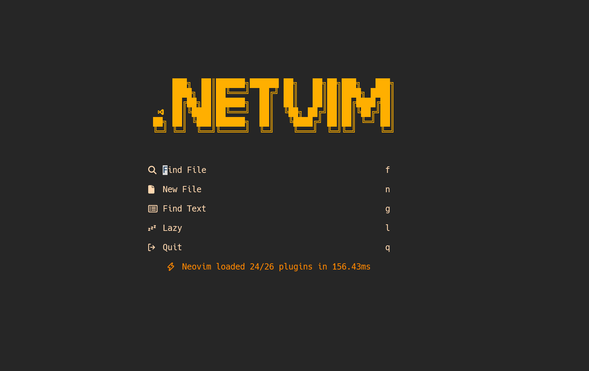

# .NetVim
A neovim distribution designed around developing in .NET and C# code.

# Plugins
- Lazy Plugin Manager
- Treesitter
- Telescope, Telescope-ui-select
- Nuget
- NoneLS
- NeoTree
- Mason, Mason-lspconfig, nvim-lspconfig
- Dashboard
- AutoComplete and Snippets via cmp-nvim-lsp, nvim-cmp, luasnip, and friendly snippets
- Using c_sharp and Omnisharp lsps
<!---
Still need to set up debugging and project creation
--->
# Installation
## COMMON INSTALLATION(Linux, Windows, WSL)
### Config Install
Make sure you have NeoVim installed.
#### Windows
you will need to clone this repo into `C:\Users\username\AppData\nvim` you may not have this directory, you will need to create it if so
#### WSL/Linux
you will need to clone this repo into `~/.config/nvim` you may not have this directory, you will need to create it if so
### Omnisharp, LiveGrep
Use whichever method for your platform that you install Omnisharp(WSL users will need to install Omnisharp onto their windows machine)

```winget install Omnisharp```

``` sudo apt-get install Omnisharp ```

Afterward, you will need to input the location of your `Omnisharp.exe' into the 'mason.lua' file:

```
local omnisharp_bin = "PATH/TO/YOUR/OmniSharp.exe"

```

After that, mason should be able to utilize Omnisharp.

## Windows Requirements
If using NeoVim on Windows, you will need to install a C compiler, I used zig

`winget install zig'

you will also need to install ripgrep to get Telescope's LiveGrep functionality:

`winget install ripgrep'

